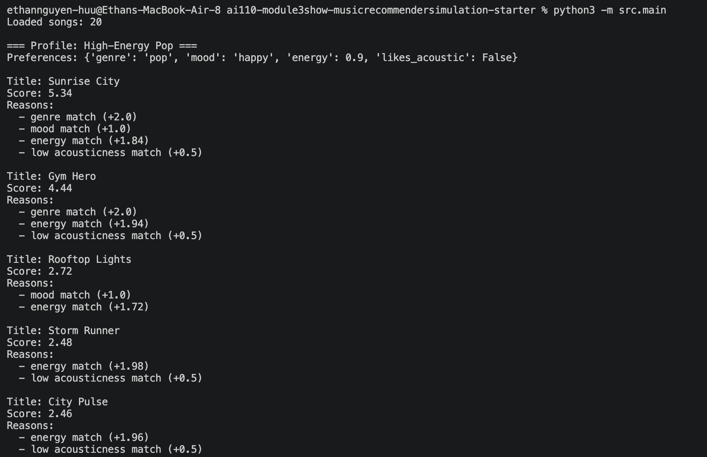
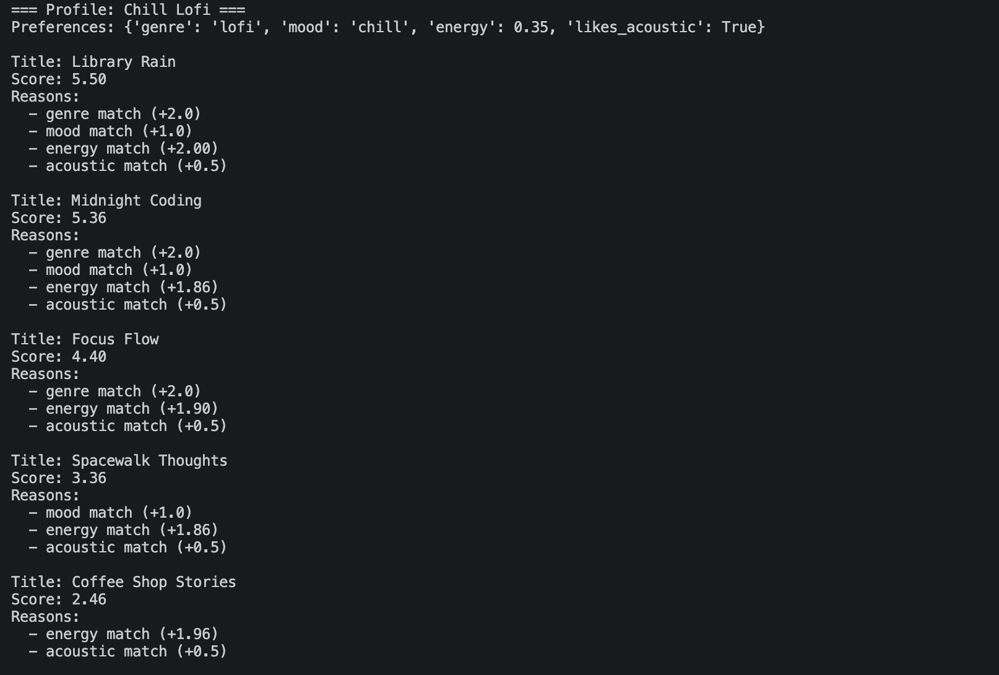
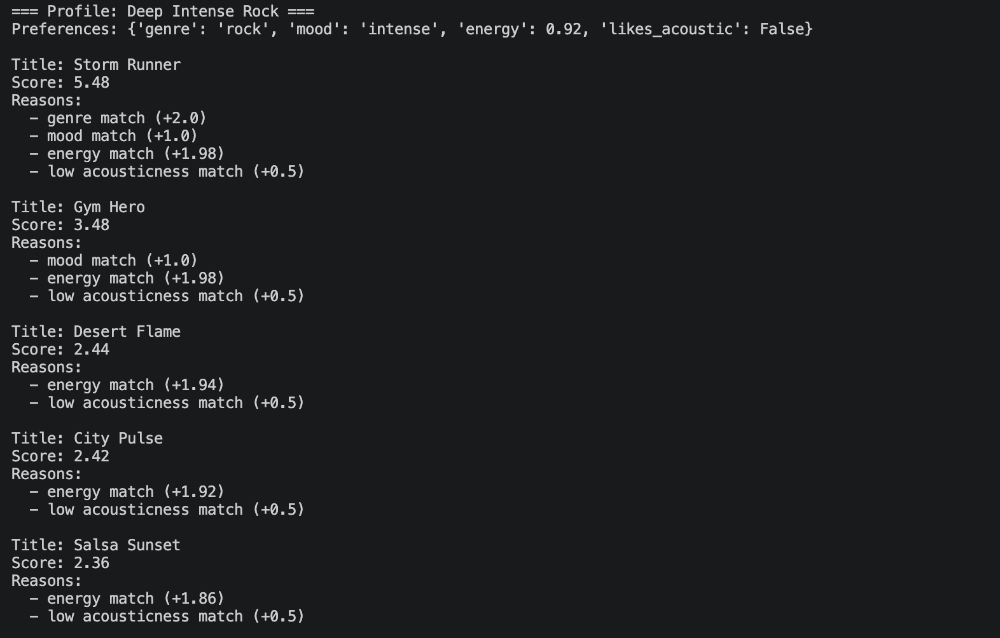
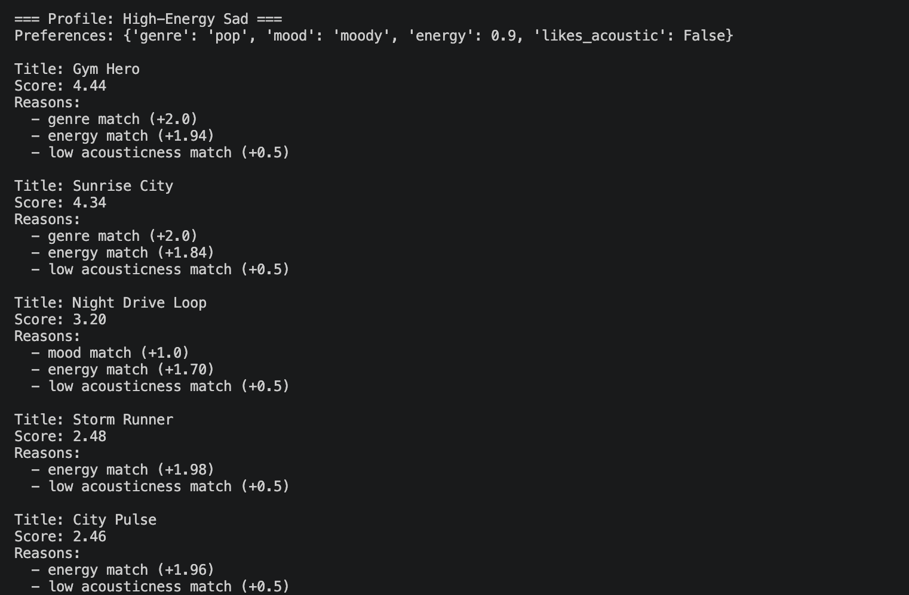
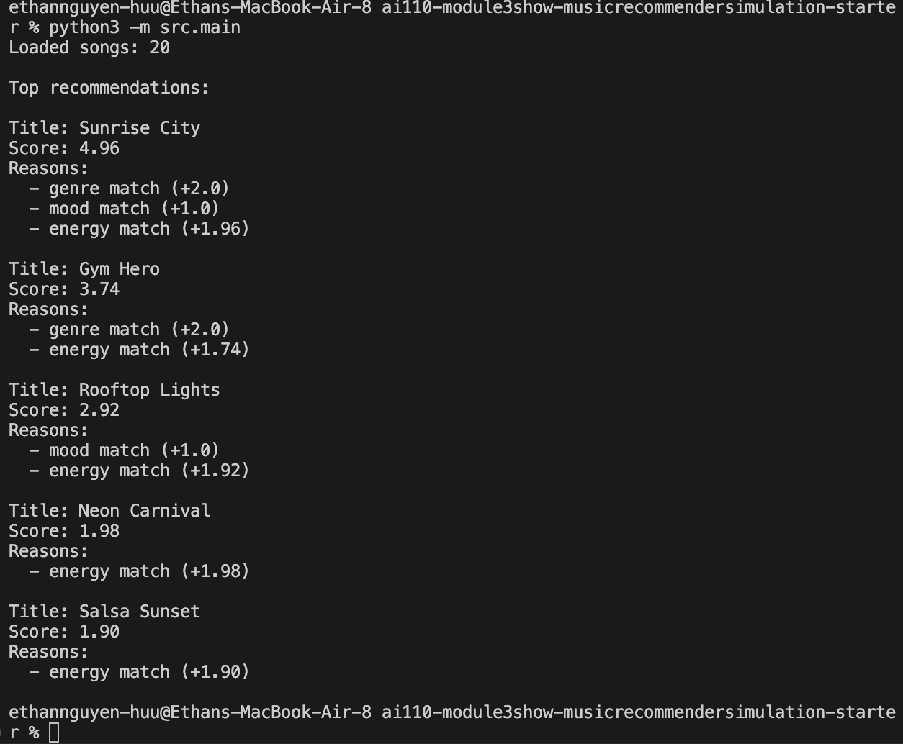

# 🎵 Music Recommender Simulation

## Project Summary

This version reads songs from `data/songs.csv` and turns each track into a score based on a user's stated taste. It uses genre, mood, energy, and acoustic preference to rank songs, then prints the top matches. The goal is to show how a small content-based recommender can work and to test how weights affect what the system chooses.

---

## How The System Works

This recommender uses a content-based scoring system built from song metadata and the user's preferences.

Inputs
- `songs.csv` provides song metadata like `genre`, `mood`, `energy`, `tempo_bpm`, `valence`, `danceability`, and `acousticness`.
- `main.py` defines profile dictionaries for different users, such as High-Energy Pop and Chill Lofi.

What it does
- Loads each song from CSV into memory.
- Scores each song for the user by comparing genre, mood, energy closeness, and acoustic preference.
- Ranks songs by total score and returns the top `k`.

Why it works
- A genre match adds a big boost.
- A mood match adds a smaller boost.
- Energy closeness is calculated by how near the song's energy is to the user's target energy.
- Acoustic preference is a small bonus that helps pick more acoustic or more produced tracks.

Potential Biases
- Genre still has a strong influence, so the system can favor songs from the same style.
- Energy has become more important after experiments, which means the system now prefers songs that feel right in intensity even if the mood is slightly off.
- With a small dataset, the same songs can appear for multiple profiles, so diversity is limited.

You can include a simple diagram or bullet list if helpful.

---

## Getting Started

### Setup

1. Create a virtual environment (optional but recommended):

   ```bash
   python -m venv .venv
   source .venv/bin/activate      # Mac or Linux
   .venv\Scripts\activate         # Windows

2. Install dependencies

```bash
pip install -r requirements.txt
```

3. Run the app:

```bash
python -m src.main
```

### Running Tests

Run the starter tests with:

```bash
pytest
```

You can add more tests in `tests/test_recommender.py`.

---

## Experiments You Tried

Use this section to document the experiments you ran. For example:

- What happened when you changed the weight on genre from 2.0 to 0.5
- What happened when you added tempo or valence to the score
- How did your system behave for different types of users
- What changed when energy was doubled and genre weight was lowered

### Stress test profiles

I ran several diverse user profiles to evaluate the recommender's behavior:

- **High-Energy Pop**: `{genre: pop, mood: happy, energy: 0.9, likes_acoustic: False}`
- **Chill Lofi**: `{genre: lofi, mood: chill, energy: 0.35, likes_acoustic: True}`
- **Deep Intense Rock**: `{genre: rock, mood: intense, energy: 0.92, likes_acoustic: False}`
- **High-Energy Sad**: `{genre: pop, mood: moody, energy: 0.9, likes_acoustic: False}`

The top recommendations exposed how the model prioritizes genre and energy similarity, and helped reveal edge cases like conflicting energy/mood preferences.


Figure 1: Terminal output for the High-Energy Pop profile.


Figure 2: Terminal output for the Chill Lofi profile.


Figure 3: Terminal output for the Deep Intense Rock profile.


Figure 4: Terminal output for the High-Energy Sad profile.


---

## Limitations and Risks

This recommender is built on a tiny catalog, so it cannot represent many musical tastes. It also gives high weight to energy and genre, which can make the same fast pop songs appear for multiple profiles. The system does not understand lyrics, artist popularity, or user listening history, so it is only a rough approximation of real music recommendations.

---

## Reflection

I learned that a very simple scoring system can still feel like a recommendation engine when it uses genre, mood, and energy together. The biggest surprise was how much the energy score changes the output: once energy was made more important, the model started favoring fast songs even when the mood was not an exact match.

Using AI tools helped structure the code and suggest logic, but I had to double-check the actual math and ranking myself. A simple algorithm can still seem smart because it matches the strongest signals in the data, but it can also be wrong when a user's preferences are mixed or contradictory.


---

## 7. `model_card_template.md`

Combines reflection and model card framing from the Module 3 guidance. :contentReference[oaicite:2]{index=2}  

```markdown
# 🎧 Model Card - Music Recommender Simulation

## 1. Model Name

Give your recommender a name, for example:

> VibeFinder 1.0

---

## 2. Intended Use

- What is this system trying to do
- Who is it for

Example:

> This model suggests 3 to 5 songs from a small catalog based on a user's preferred genre, mood, and energy level. It is for classroom exploration only, not for real users.

---

## 3. How It Works (Short Explanation)

Describe your scoring logic in plain language.

- What features of each song does it consider
- What information about the user does it use
- How does it turn those into a number

Try to avoid code in this section, treat it like an explanation to a non programmer.

---

## 4. Data

Describe your dataset.

- How many songs are in `data/songs.csv`
- Did you add or remove any songs
- What kinds of genres or moods are represented
- Whose taste does this data mostly reflect

---

## 5. Strengths

Where does your recommender work well

You can think about:
- Situations where the top results "felt right"
- Particular user profiles it served well
- Simplicity or transparency benefits

---

## 6. Limitations and Bias

Where does your recommender struggle

Some prompts:
- Does it ignore some genres or moods
- Does it treat all users as if they have the same taste shape
- Is it biased toward high energy or one genre by default
- How could this be unfair if used in a real product

---

## 7. Evaluation

How did you check your system

Examples:
- You tried multiple user profiles and wrote down whether the results matched your expectations
- You compared your simulation to what a real app like Spotify or YouTube tends to recommend
- You wrote tests for your scoring logic

You do not need a numeric metric, but if you used one, explain what it measures.


---

## 8. Future Work

If you had more time, how would you improve this recommender

Examples:

- Add support for multiple users and "group vibe" recommendations
- Balance diversity of songs instead of always picking the closest match
- Use more features, like tempo ranges or lyric themes

---

## 9. Personal Reflection

A few sentences about what you learned:

- What surprised you about how your system behaved
- How did building this change how you think about real music recommenders
- Where do you think human judgment still matters, even if the model seems "smart"


